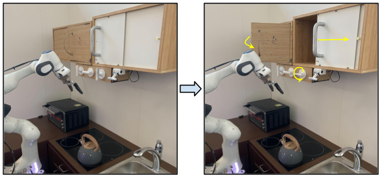
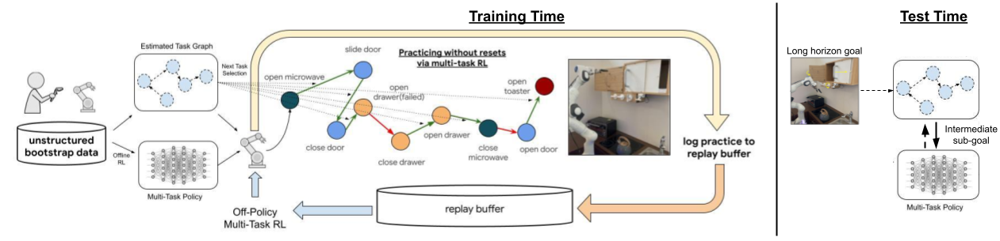
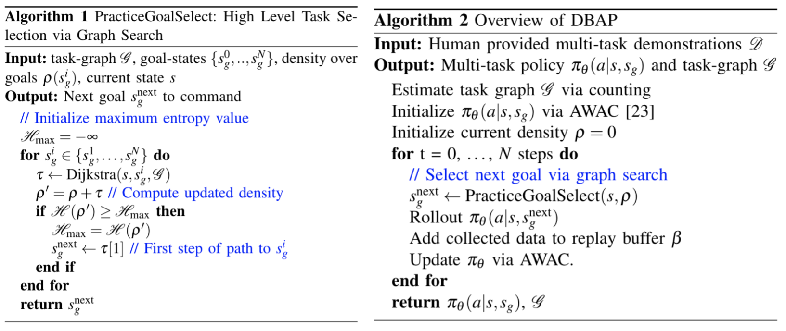
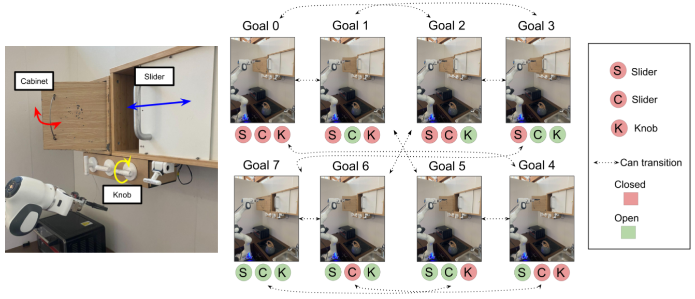
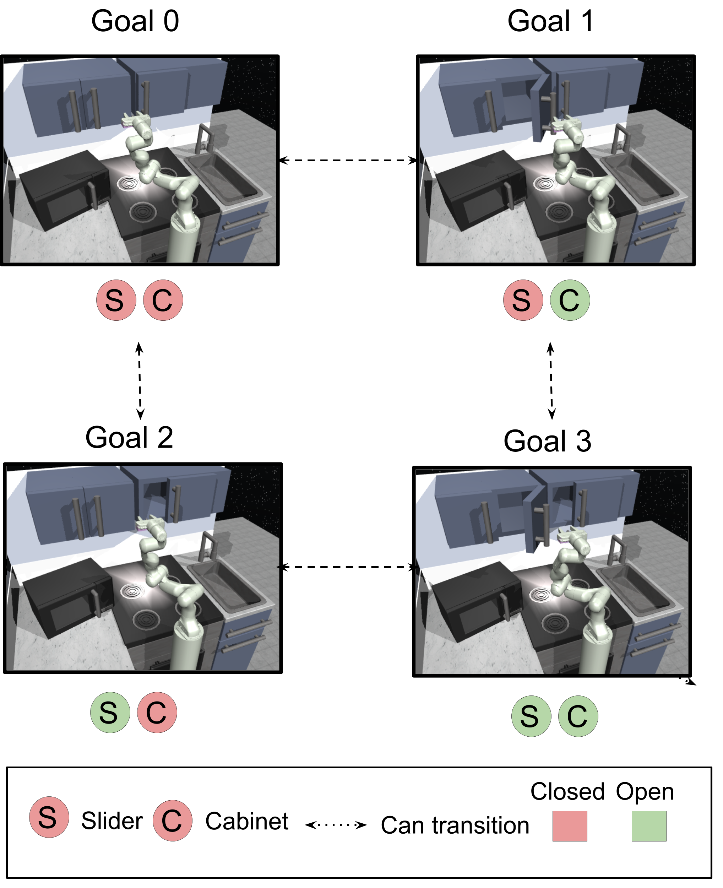
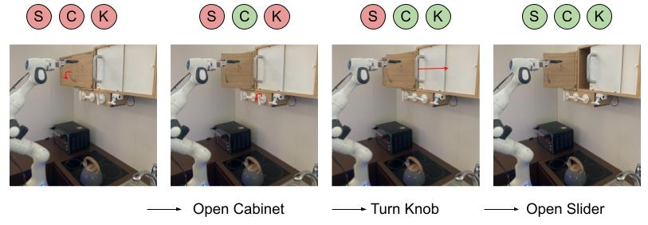
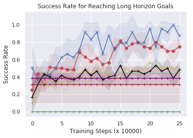
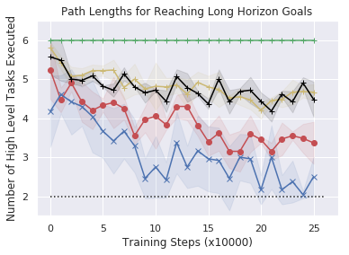

## Abstract

Reinforcement learning systems have the potential to enable continuous improvement in unstructured environments, leveraging data collected autonomously. However, in practice these systems require significant amounts of instrumentation or human intervention to learn in the real world. In this work, we propose a system for reinforcement learning that leverages multi-task reinforcement learning bootstrapped with prior data to enable continuous autonomous practicing, minimizing the number of resets needed while being able to learn temporally extended behaviors. We show how appropriately provided prior data can help bootstrap both low-level multi-task policies and strategies for sequencing these tasks one after another to enable learning with minimal resets. This mechanism enables our robotic system to practice with minimal human intervention at training time, while being able to solve long horizon tasks at test time. We show the efficacy of the proposed system on a challenging kitchen manipulation task both in simulation and the real world, demonstrating the ability to practice autonomously in order to solve temporally extended problems.

______


## 1. Introduction
Consider a robot deployed in a previously unseen kitchen, such as the one shown in Fig 1. Since this is an unfamiliar environment, the robot might not know exactly how to operate all the kitchen appliances, open cabinets, operate the microwave or turn on the burners, especially if these need to be done in a specific sequence resulting in a long-horizon task. Like many intelligent agents, the robot needs some practice, making reinforcement learning (RL) a promising paradigm. However, as we have learn from prior work, practicing long-horizon tasks with RL is difficult for reasons such as exploration <dt-cite key="gupta2019relay">Gupta et al.</dt-cite>, environment resets~<dt-cite key="han2015learning">Han et al.</dt-cite>, and credit assignment problems <dt-cite key="harutyunyan2019hca">Harutyunyan et al.</dt-cite>. The process of building robotic learning systems (especially with RL) is never as simple as placing a robot in the environment and having it continually improve. Instead, human intervention is often needed in the training process, especially to provide resets to the learning agent. Ideally, we would want to provide the robot with a small number of examples to help with these challenges in the training process and do so at the beginning of the practicing process so that it can continually practice a wide range of tasks in the kitchen on its own, with minimal human intervention. 

In this work, we consider the following perspective on this problem. Rather than only providing examples that aim to aid the final solution (e.g. by providing demonstrations of the final long-horizon tasks), we additionally focus on providing supervision that helps the robot to continue practicing long-horizon tasks autonomously. 
In particular, we provide a set of continuous, uninterrupted multi-task demonstrations  <dt-cite key="gupta2019relay">Gupta et al.</dt-cite>,  <dt-cite key="lynch2020learning">Lynch et al.</dt-cite> that illustrate example behaviors and goal states that the robot should be able to acquire and robustly achieve. The continuous aspect of the demonstrations provides two benefits: i) it breaks up the long-horizon tasks into smaller subgoals that can be used as intermediate points, and ii) it provides data *in-between* the tasks, showing the robot examples of behaviors where some of the tasks are not fully finished but are reset using other tasks - a case that often happens during the autonomous execution of the policy.
Equipped with the continuous demonstrations, we can learn how to sequence different tasks one after the other and, use that ability to have some tasks provide resets for others, enabling the robot to practice many tasks autonomously by resetting itself without actually needing constant human intervention in the learning process. For instance, if the robot is practicing opening and closing the cabinet in Fig 1, it may start in a state where the cabinet is closed and command the task to open it. Even if this task does not succeed and the cabinet is partially open, the agent can continue practicing any of the remaining tasks including closing or opening the cabinet to minimize the requirement for resets, naturally resetting the environment by just solving different tasks. 
At test time, we can then utilize the same ability of sequencing different tasks to sequence multiple subgoals for completing long-horizon multi-stage tasks.

<div class="figure">

<figcaption>
Figure 1. Robot setup for real world training in a kitchen. The robot needs to manipulate multiple different elements to accomplish complex goals.
</figcaption>
</div>

In this paper, we present a novel robotic learning system, which we call demonstration bootstrapped autonomous practicing (DBAP), that is able to incorporate a small amount of human data provided upfront to bootstrap long periods of autonomous learning with just a few human interventions for episodic resets, using some tasks to reset others while learning how to perform long horizon behaviors. We show that just a few hours of easily-provided ``play-style''(<dt-cite key="gupta2019relay">Gupta et al.</dt-cite>,  <dt-cite key="lynch2020learning">Lynch et al.</dt-cite>) multi-task demonstrations can make the entire learning process more efficient, bootstrapping both policy learning and autonomous practicing of behaviors, eventually showing the ability to perform long-horizon multi-step tasks. Our experiments indicate that this paradigm allows us to efficiently solve complex multi-task robotics problems both in simulation and in a real world kitchen environment, with an order of magnitude less human intervention needed during learning than typical RL algorithms.


## 2. Related Work


Most prior applications of RL in robotic manipulation rely on an episodic reset mechanism, which brings the robot back to a static distribution over initial states. Recent work has attempted to relax the episodic reset assumption <dt-cite key="co2020ecological">Co-Reyes et al.</dt-cite>, <dt-cite key="zhu2020ingredients">Zhu et al.</dt-cite>,  <dt-cite key="eysenbach2017leave">Eysenbach et al.</dt-cite>,  <dt-cite key="han2015learning">Han et al.</dt-cite>, by either learning an explicit reset controller <dt-cite key="eysenbach2017leave">Eysenbach et al.</dt-cite>,  <dt-cite key="han2015learning">Han et al.</dt-cite> or learning a perturbation controller (<dt-cite key="zhu2020ingredients">Zhu et al.</dt-cite>) to randomly reset the state. As opposed to these works, we operate in the continual multi-task setting. Recent work (<dt-cite key="gupta2021reset">Gupta et al.</dt-cite>, <dt-cite key="han2015learning">Han et al.</dt-cite>) has approached the problem through the lens of multi-task learning, but require significant human effort to design how tasks should be sequenced, relying on human-defined state machines. In contrast, our work shows how we can bootstrap the autonomous learning process with human-provided prior data, obviating the need for hand definition of task sequencing state-machines. 

There are multiple approaches that aim to use demonstrations to provide a good initialization for policies via learning from demonstrations (<dt-cite key="mulling2013learning">Mulling et al.</dt-cite>, <dt-cite key="manschitz2015learning">Manschitz et al.</dt-cite>, <dt-cite key="rajeswaran2017learning">Rajeswaran et al.</dt-cite>, <dt-cite key="gao2018reinforcement">Gao et al.</dt-cite>, <dt-cite key="billard2008survey">Billard et al.</dt-cite>, <dt-cite key="mandlekar2020gti">Mandlekar et al.</dt-cite>). In a similar vein, algorithms for offline RL (<dt-cite key="levine2020offline">Levine et al.</dt-cite>) aim to use large datasets to bootstrap learning, without making explicit assumptions about the provided data. Most algorithms for offline RL aim to enable training from static offline datasets, by preventing the off-policy bootstrap from diverging due to internal distribution shift (<dt-cite key="levine2020offline">Levine et al.</dt-cite>, <dt-cite key="fujimoto2019off">Fujimoto et al.</dt-cite>, <dt-cite key="kumar2019stabilizing">Kumar et al.</dt-cite>, <dt-cite key="mandlekar2020iris">Mandlekar et al.</dt-cite>, <dt-cite key="kumar2020conservative">Kumar et al.</dt-cite>, <dt-cite key="peng2019advantage">Peng et al.</dt-cite>, <dt-cite key="wang2020critic">Wang et al.</dt-cite>, <dt-cite key="nair2020accelerating">Nair et al.</dt-cite>, <dt-cite key="kostrikov2021offline">Kostrikov et al.</dt-cite>, <dt-cite key="singh2020cog">Singh et al.</dt-cite>). While most of these are in purely offline settings, recently there have been approaches (<dt-cite key="nair2020accelerating">Nair et al.</dt-cite>, <dt-cite key="deploymentorl">Matsushima et al.</dt-cite>) that bootstrap initial policies offline but aim to also continue finetuning. In contrast to these papers, which utilize offline data simply as an initialization for a task policy that can be finetuned online but assume complete access to episodic resets, our aim is to instead utilize the provided data to learn how to perform autonomous practicing: for our method the prior data doesn't just provide a good initialization for a single task, but a set of useful behaviors that the agent can use to reset itself after failed attempts, and chain together to perform multi-stage behaviors. 


Long horizon problems have often been approached from the angle of hierarchical RL algorithms (<dt-cite key="dayan92feudal">Dayan et al.</dt-cite>, <dt-cite key="dietterich98maxq">Dietterich et al.</dt-cite>, <dt-cite key="sutton99options">Sutton et al.</dt-cite>, <dt-cite key="plb2017optioncritic">Bacon et al.</dt-cite>, <dt-cite key="nachum18hiro">Nachum et al.</dt-cite>, <dt-cite key="gupta2019relay">Gupta et al.</dt-cite>, <dt-cite key="levy2019hac">Levy et al.</dt-cite>, <dt-cite key="eysenbach2019sorb">Eysenbach et al.</dt-cite>,  <dt-cite key="savinov18sptm">Savinov et al.</dt-cite>,  <dt-cite key="kreidieh2019marlhrl">Kreidieh et al.</dt-cite>,  <dt-cite key="barto2003hrl">Barto et al.</dt-cite>). These algorithms aim to learn high-level policies that sequence low-level policies to solve temporally extended tasks. As opposed to these methods, in addition to sequencing low-level tasks for long-horizon goals, our system is also used as a means to perform autonomous practicing with minimal human interventions.  Perhaps most closely related to our work, relay policy learning (RPL) (<dt-cite key="gupta2019relay">Gupta et al.</dt-cite>), uses demonstrations to bootstrap a hierarchical learning setup. However, RPL does not address the question of human effort and assumes episodic resets at training time, which DBAP alleviates. 

## 3. Preliminaries and Problem Statement

We use the standard MDP formalism $\mathcal{M} = (S, A, P, r, T)$ (state, action, dynamics, reward, episodic horizon), but extend RL to goal-reaching tasks, where the task is represented as a state goal $s_g$ that the goal-conditioned policy $\pi_\theta(a|s, s_g)$ has to reach to obtain the reward. We assume to be given a set of $N$ goal states that are of particular interest: $S_{g_i} = \{s_g^i\}_{i=1}^N$ that the agent is expected to to reach from any other state of interest, resulting in the following objective: 

<!-- $\max_{\phi, \theta} \mathbb{E}_{(s, a, s_g^l) \sim D_l}[\log \pi_{\phi}(a|s, s_g^l)] + 
\mathbb{E}_{(s, s_g^l, s_g^h) \sim D_h}[\log \pi_{\theta}(s_g^l|s, s_g^h)]$ -->

$\max_{\theta} \mathbb{E}_{s_0 = s_g^i, a_t \sim \pi_{\theta}(a_t|s_t, s_g^j)}\sum_{t=1}^T r(s_t, a_t, s_g^j) \forall s_g^i \in S_{g_i}, s_g^j \in S_{g_i}$

We often refer to reaching these goals of interests as *tasks* since reaching such states usually corresponds to accomplishing a meaningful task such as opening a cabinet. Note that reaching certain $s_g^j$ from $s_g^i$ would involve just short horizon behaviors spanning a single episode, while reaching other $s_g^j$ from $s_g^i$ may require long horizon reasoning over multiple different sub-steps, for instance it may require reaching $s_g^k, s_g^l, ...$ on the path from $s_g^i$ to $s_g^j$.

In order to allow for more autonomous learning with minimal human supervision, we assume that a reset can be provided every $n$ episodes (or every $nT$ time steps). Our objective in this case is to train the agent in a training MDP $\mathcal{M}' = (S, A, P, r, nT)$, where resets are only received every $nT$ steps such that we are able to learn a policy $\pi$ that is effective on the original episodic problem described in Eq. 1. This requires our learning algorithm to operate in a non-stationary setting and learn how to practice tasks mostly autonomously with only occasional resets as discussed in several prior works <dt-cite key="eysenbach2017leave">Eysenbach et al.</dt-cite>, <dt-cite key="gupta2021reset">Gupta et al.</dt-cite>, <dt-cite key="zhu2020ingredients">Zhu et al.</dt-cite>.


**AWAC:** As we will discuss next, solving this problem effectively for long horizon tasks requires us to incorporate demonstrations to bootstrap both the policy and the autonomous practicing mechanism. In order to effectively incorporate prior demonstrations to bootstrap policy learning, we use the recently developed AWAC algorithm  <dt-cite key="nair2020accelerating">Nair et al.</dt-cite>. The main idea behind AWAC is to constrain the actor policy to be within the training data distribution, which addresses the problem of overly optimistic Q-function estimates on unseen state-action pairs <dt-cite key="kumar2019stabilizing">Kumar et al.</dt-cite>, <dt-cite key="kumar2020conservative">Kumar et al.</dt-cite>.

In particular, the AWAC algorithm applies the following weighted maximum likelihood update to the actor:

$\theta_{k+1} = \max_\theta \mathbb{E}_{s, a} \left[\log \pi_\theta(a|s) \exp \left(\frac{1}{\lambda}A^{\pi_\theta}(s, a) \right)\right]$

where is $A$ is the advantage function, and $\lambda$ is a hyper-parameter. Since the actor update in AWAC samples and re-weights the actions from the previous policy, it implicitly constrains the policy. We directly build on this framework for policy bootstrapping but in the following section show how we can additionally bootstrap autonomous practicing from offline data as well.  

## 4. Demonstration Augmented Autonomous Practicing for Multi-Task Reinforcement Learning


<div class="figure">

<figcaption>
Figure 2. Given human-provided unstructured demonstrations, the system bootstraps a multi-task RL policy via offline RL and builds a task graph that models transitions between different tasks. The system then practices the tasks autonomously with small number of resets, using the task graph to command the appropriate next task. The resulting multi-task policy and task graph are then used to solve long-horizon problems at test-time.
</figcaption>
</div>


Our method, Demonstration-Bootstrapped Autonomous Practicing (DBAP) learns how to perform complex behaviors in an environment by leveraging human-provided demonstration data in two ways: to bootstrap a multi-task policy that learns to perform a variety of behaviors; and to enable a graph-based sequencing mechanism, which allows for autonomous improvement by choosing what sequence of these behaviors to command to minimize number of resets at training time. In doing so, this sequencing mechanism  helps to practice each behavior at training time while also enabling the robot to sequence practiced behaviors to accomplish long-horizon tasks at test time. An overview of our overall framework is presented in Fig 2. Given a human-provided dataset, we leverage an offline RL algorithm to bootstrap a multi-task policy, while using a graph search algorithm to i) decide how to sequence tasks for practicing to improve this multi-task policy with minimal resets at training time and ii) deciding how to sequence behaviors to solve long-horizon tasks at test-time. 

More precisely, we learn a single goal-conditioned policy for multiple tasks, denoted $\pi_\theta(a|s, s_g)$, where $s_g$ is a goal state. To learn this goal-conditioned policy, we instantiate a goal-conditioned version of AWAC  <dt-cite key="nair2020accelerating">Nair et al.</dt-cite>, where the policy is provided with the state goal $s_g$ alongside the current state $s$, yielding the following policy update:
$\theta_{k+1} = \max_\theta \mathbb{E}_{s, a, s_g} \left[\log \pi_\theta(a|s, s_g) \exp \left(\frac{1}{\lambda}A^{\pi_\theta}(s, a, s_g) \right)\right]$, 
where $A^{\pi_\theta}$ is an advantage function for the current, goal-conditioned policy $\pi_\theta$. This goal conditioned policy is directly bootstrapped from human provided data as described in prior work  <dt-cite key="nair2020accelerating">Nair et al.</dt-cite>. Prior data is not just used for policy bootstrapping but to autonomously improve this bootstrapped multi-task policy through autonomous practicing with minimal numbers of human resets, while also being able to leverage the policy and practicing mechanism appropriately to solve long horizon problems. 

In order to enable agents to practice on their own with minimal number of human interventions, we require a task-sequencing policy that determines how the goals are sequenced at training time.
In particular, a task-sequencing policy $\pi^\text{hi}(s_g|s, s_g^{\text{desired}})$ decides which goal of interest $s_g$ to command next from the current state during practicing. 
This resembles high-level policies used in hierarchical RL that are commonly used to sequence individual subgoals for accomplishing long-horizon goals. 
However, in this scenario, $\pi^\text{hi}(s_g|s, s_g^{\text{desired}})$ is not just used to accomplish long-horizon goals at test-time but also to enable autonomous practicing at training time. In the following sections we will often refer to the multi-task policy $\pi_\theta(a|s, s_g)$ as the low-level policy, and the task sequencer $\pi^\text{hi}(s_g|s, s_g^{\text{desired}})$ as the high-level policy. 

**Assumptions:** Before we dive into system details, we discuss some assumptions made in our problem setting. Firstly, we assume that the environment does not end up in irrecoverable states from which no action can bring the environment back to goals of interest. This assumption is common across a variety of reset-free RL algorithms  <dt-cite key="gupta2021reset">Gupta et al.</dt-cite>, <dt-cite key="han2015learning">Han et al.</dt-cite>,<dt-cite key="gupta2021reset">Gupta et al.</dt-cite>,<dt-cite key="ha2020learning">Ha et al.</dt-cite>,<dt-cite key="eysenbach2017leave">Eysenbach et al.</dt-cite> and spans a wide range of practical tasks in robotic manipulation and locomotion. We also assume that the states can be discretely grouped into different tasks or goals of interest, which in our case is done by a discrete thresholding operation (more details on our [supplementary website](https://sites.google.com/view/dbap/home). This can be extended to high-dimensional environments using clustering or representation learning algorithms.


**Task Sequencing via Graph Search**

A successful high-level task sequencer policy $\pi^\text{hi}$ is one that at training time is able to propose goals for autonomous practicing, while at test time is able to direct the agent towards reaching long-horizon goals. To learn such a task sequencer policy $\pi^\text{hi}$, we propose a simple model-based graph search algorithm. Note that $\pi^\text{hi}$ is not a neural network, but the result of a search procedure. As we show empirically in our experimental evaluation, this is more flexible and robust than parameterizing $\pi^\text{hi}$ directly with a neural network. 

The key idea in our approach is to leverage prior data to learn which low-level task transitions are *possible* and can be sequenced, and then use this knowledge to optimize for *both* autonomous practicing (at training time) and long-horizon goal sequencing (at test time). 
In particular, we utilize the provided data to build a directed task graph $\mathcal{G}$, with vertices as different goal states of interest $s_g^i$, $s_g^j$, and an adjacency matrix $A$ with $A(i, j) = 1$ if there exists a transition between particular states of interest $s_g^i$ and $s_g^j$ in the demonstration data, and $A(i, j) = 0$ otherwise. This graph can be thought of as a discrete high-level model, which represents how different goal states of interest are connected to each other. Given this graph $G$ acquired from the prior data, we can then utilize it for both autonomous practicing of low-level tasks and for sequencing multiple low-level tasks to achieve multi-step goals. We describe each of these phases next.

**Autonomous practicing (training time).** As described in prior work <dt-cite key="zhu2020ingredients">Zhu et al.</dt-cite>, maintaining a uniform distribution over tasks helps when learning with minimal resets by ensuring all tasks are equally represented in the learning process. The task graph $\mathcal{G}$ is used to direct autonomous practicing by explicitly optimizing to command goals that bring the overall coverage over states close to the uniform distribution, while also minimizing the number of human interventions.


In particular, the algorithm iterates through all possible goal states of interest $s_g^i$, determines the shortest path from the current state to the goal state via Dijkstra's algorithm <dt-cite key="dijkstra1959note">Dijkstra et al.</dt-cite>, and computes the resulting densities over goal states if that path was chosen. The path that results in bringing the density closest to uniform (i.e. maximum entropy) is then picked, and the first step in the path (i.e. a short-horizon goal) is commanded as the next goal state. 

This ensures that the algorithm maintains uniform coverage over different goal states of interest in the environment, so that all tasks can be practiced equally. This process repeats at the next step, thereby performing receding horizon contro (<dt-cite key="garcia89surveympc">Garcia et al.</dt-cite>) to maintain the density over potential goal states of interest to be as close to uniform as possible, while training the policy to keep practicing how to accomplish various short horizon goals. 

Formally, the objective being optimized to select which goal to sequence next is given by: 

$\max_{s_g^i \in S_g^i} \mathcal{H}(\mathcal{U}, \rho + \text{Djikstra}(s, s_g^i))$


where $\rho$ is the current marginal distribution (represented as a categorical distribution) over goal states of interest, $\text{Dijkstra}(s, s_g^i)$ computes the shortest distances between current state $s$ and $s_g^i$ and the goal is to bring the updated density as closer to uniform $\mathcal{U}$. We overload the $+$ operator here to denote an update to the density $\rho$ when accounting for new states.}. A detailed description can be found in Algorithm 1.

**Task sequencing for long-horizon tasks (test time).** Next, we ask how short-term behaviors learned by the multi-task policy $\pi_\theta(a|s, s_g)$ can be sequenced to accomplish long-horizon goals. We note that the same graph search mechanism used for autonomous practicing at training time can be reused to sequence appropriate sub-goals at test time to accomplish long horizon tasks.

More formally, given a target goal of interest $s_g^j$ when the agent is at a particular state $s$, we can use the estimated graph $\mathcal{G}$ via Dijkstra's algorithm to compute the shortest path between the current state and the goal of interest $s_g^j$, $\tau = [s, s_g^1, s_g^2, ..., s_g^j]$. The next goal state of interest in the path $s_g^1$ is then chosen as the next goal commanded to the multi task policy $\pi(a|s, s_g^1)$ and executed for a single episode of $T$ steps till the agent reaches $s_1$. This procedure is repeated until the agent accomplishes $s_g^j$. Further details on these procedures can be found in Algorithm 1 and Algorithm 2. 

<div class="figure">

</div>

## 5. System Description

To evaluate (DBAP) in the real world, we built a physical kitchen environment based on the kitchen manipulation benchmark described in prior work (<dt-cite key="gupta2019relay">Gupta et al.</dt-cite>).

<div class="figure">

<figcaption>
Figure 4. Elements, tasks, and goals in the real-world kitchen environment. The agent is manipulating the cabinet, slider and knob to accomplish particular configurations as shown in goals $0$ to $7$. The dotted lines represent individual transitions, toggling one element at a time between its extreme positions. The goal of the agent is to learn a policy and a graph controller that is able to transition between goal states.
</figcaption>
</div>

**Tasks.** In this environment, we task a 7 DoF Franka Emika robotic arm with manipulating three distinct elements: a sliding door that can be slid open or closed, a cabinet door that can be open or closed and a knob that can rotate to control the stove burners, as shown in Fig 4. At each time step, the policy chooses a position and orientation for the end effector, or opens/closes the gripper.
These three elements represent distinct types of motion, each of which require different control strategies. The goal states of interest $s_g^i$ are defined as combinations of the elements being opened or closed (or in the case of the knob, turned by $0$ degrees or $90$ degrees), resulting in $2^3 = 8$ goal states based on combinations of the elements being open or closed (Fig 4). 


As described in Sections 3, 4, the agent must practice reaching the goals of interest autonomously in the environment to master going from any combination of element configurations to any other. The agent is said to be in one of the goal states of interest if the current state of the elements in the scene are within $\epsilon$ distance of the goal. Long horizon goals involve flipping the state (from open to close or vice versa) of all three elements of the scene, requiring sequential reasoning. 


**Data collection.** We make use of a teleoperation system to provide a continuous sequence of multi-task demonstrations. We collect ``play-style'' (<dt-cite key="lynch2020learning">Lynch et al.</dt-cite>, <dt-cite key="gupta2019relay">Gupta et al.</dt-cite>) demonstrations, where different tasks are attempted successfully one after the other, indicating both how tasks are solved and how they may be sequenced. We make a simple change to the data collection procedure where the user indicates when a particular goal state of interest is completed before transitioning over to demonstrating a different goal. This allows the algorithm to easily determine the goals of interest as the transition points between these human-provided demonstrations. We provide around $500$ demonstrations in the real world, requiring $2.5$ hours of data collection time. 


**Simulation Environment**

<div class="figure">

<figcaption>
Figure 5. Simulated tasks in kitchen
</figcaption>
</div>


To provide thorough quantitative comparisons, we also evaluate our method on a simulated version of the above task, based on the MuJoCo kitchen manipulation environment described out by <dt-cite key="gupta2019relay">Gupta et al.</dt-cite>. The purpose of this evaluation is to study the behavior of different components of the system in detail and more systematically run comparisons. In particular, in simulation we consider tasks with 2 elements (Fig 5): the cabinet and the slider. The  goal states correspond to combinations of cabinet and slider being open and closed. 


## 6. Experimental Evaluation

In our experimental evaluation, we aim to answer the following questions: 

1. Does DBAP allow agents to learn how to perform long horizon behaviors in the real world?
2. Does DBAP reduce the number of human resets required to learn long horizon behaviors, as compared to existing methods?
3. Is DBAP able to use prior data to bootstrap the learning of both low-level policy execution and high level practicing behavior?


To understand the decisions made in DBAP, we compare to a number of baselines in simulation and the real world. For real-world experiments, we compare DBAP to behavior cloning without any finetuning (Imitation in Table 1), offline RL with AWAC without finetuning (Offline RL in  Table 1) and the no pre-training baseline. The policies operate on a low-level state of object and end effector positions, and they are represented with 3 layer MLPs of $256$ units each. Find more details of the method, system  architecture, ablations, visualizations of the data at our [supplementary website](https://sites.google.com/view/dbap/home)


In simulation we compared with the following: **i) Non-pretrained low level, graph search high level:** This is a version of our algorithm, where the human-provided data is not used to bootstrap low level policies, but only the high level graph. This is related to ideas from (<dt-cite key="gupta2021reset">Gupta et al.</dt-cite>), where multiple policies are learned from scratch, but unlike that work this baseline uses a learned high level graph. **ii) Pretrained low level, random high level controller:** This is a multi-task analogue to the perturbation controller (<dt-cite key="zhu2020ingredients">Zhu et al.</dt-cite>). The low-level policy is pre-trained from human demonstrations, but the high-level practicing chooses randomly which task to execute. 
**iii) Pretrained low level, BC task selection:** This is a version of the method by (<dt-cite key="gupta2019relay">Gupta et al.</dt-cite>), modified for the minimal reset setting. Rather than using random task selection for practicing, tasks are sequenced using a high level policy trained with supervised learning on the collected data.
**iv) Pretrained low level, reset controller:**
This baseline is similar to a reset controller (<dt-cite key="han2015learning">Han et al.</dt-cite>, <dt-cite key="eysenbach2017leave">Eysenbach et al.</dt-cite>), and alternates between commanding a random task and commanding a return to a single fixed start state during practicing. In this case, the high-level policy is a random controller.
**v) Imitation low level, imitation high level:** This baseline involves training the low level and high level policies purely with imitation learning and running an offline evaluation of how well the policy performs (as in <dt-cite key="le2018hirl">Le et al.</dt-cite>).
**vi) Full relabeled relay policy learning (Gupta et al.):**	 It involves training the RPL algorithm (<dt-cite key="gupta2019relay">Gupta et al.</dt-cite>) with fully relabeled goals, as opposed to just using labeled changepoints.


**Evaluation metrics**

We evaluate over multiple long horizon goal reaching manipulation tasks in the real world environment shown in Fig 4 and simulation environment shown in Fig 5. Our real world environment has three elements (cabinet, knob, and slider) and we consider two possible goal states per element (fully open or fully closed). Each long horizon task requires changing the original state of the environment to the inverted goal state. Success requires that a given task sequencer $\pi^\text{hi}$ chain multiple low-level goal reaching behaviors to accomplish the long-horizon goal. For example, given original state ``cabinet open, knob open, and slider closed", the goal state would be ```cabinet closed, knob closed, and slider open". We construct 8 long horizon tasks in this manner and report the average success rate. 


### Demonstration-Bootstrapped Practicing in Real World

<div class="figure">

<figcaption>
Figure 6. Multi-step behavior in the kitchen that transitions between having all elements closed to all open, by first having the graph search command the agent to open the cabinet, then turn the knob and open the slider.
</figcaption>
</div>

We start by evaluating the ability of DBAP to learn multiple long horizon goal-reaching tasks in the real world. We trained the robot for over $25$ hours as described in Section 4, only requiring a reset every $50$ trajectories (in wall-clock time corresponding to once an hour only). This makes training much more practical in terms of human effort. 

As seen from the evaluation performance of offline RL on long horizon success in Table 1,
DBAP starts off doing reasonably well during pre-training, achieving a $83\%$ success rate, but improves significantly during autonomous practicing (with only very occasional resets) to around a $95\%$ success rate, indicating the importance of online finetuning. In Fig 6, we show a qualitative example of DBAP succeeding at one of the 8 long horizon tasks, where the robot must reach a goal with slider, cabinet, and microwave door all open, from a state where all three are closed. The graph search automatically commands the low-level policy to reach each of the subgoals for the complete task. The learned behaviors are best appreciated by viewing the supplementary video.


In comparison, the no-pretraining, from-scratch baseline results in 0\% success rate. This indicates the importance of being able to incorporate prior data, as is done in DBAP, to overcome hard exploration challenges inherent in long horizon manipulation. DBAP also significantly outperforms imitation learning in terms of long horizon goal-reaching performance. We compare the number of tasks commanded to accomplish the multi-step goals and observe the average path length is significantly lower for our method than baselines. 

|  | Success Rate  | Path Length  |
|:---:|:---:|:---:|
|   Offline RL|  0.83|   3.5|
|   **DBAP (Ours)**|  0.95|   3.37|
|   Imitation|   0.62|   4.3|
|   No Pretraining|   0.0|  6.0|
*Table 1:* Success rates and path lengths (in number of steps) in the real world for reaching long horizon goals.


<div class="figure">


<figcaption>
Figure 7. Performance on the simulated environment in Fig 5.**(Left)** Success rate averaged across 3 seeds each on long horizon goals **(Right)** Average number of sub-goals commanded to reach a long horizon goal
</figcaption>
</div>


### Demonstration-Bootstrapped Practicing in Simulation

Next, to study comparisons with baselines more systematically we evaluate the ability of DBAP to learn to accomplish multi-step goals in simulation as described in Section 5, 
with a minimal amounts of automatically provided resets. In simulation we assume access to one human reset every $10$ episodes, reducing the amount of human supervision by an order of magnitude as compared to standard RL.
As shown in Fig  7 (left), our method  successfully reaches a variety of multi-step goals and shows improvement over time with minimal human involvement (from $50\%$  to $90\%$ success rate). While other techniques are able to occasionally succeed, they take significantly longer to get to the goal, often resulting in roundabout paths to achieve the goal. This leads to the extended path length of trajectories in Fig 7(middle). Training a high level policy via goal relabeling and BC (the ``pretrained low-level, BC task selection'' and ``Full relabeled relay policy learning" baseline in Fig~\ref{fig:sim_results_goalreaching}.) can inherit the biases of the data. If the play data demonstrates sub-optimal paths to reach long horizon goals, this is reflected in the performance of the high-level BC. This also happens for the offline imitation learning baseline, indicating it is not a facet of offline reinforcement learning. In contrast, our graph-based search method is able to find and practice shorter paths than the baselines. Importantly, this improvement is acquired with a minimal requirement for human effort in the process.  

These studies suggest that DBAP is able to both enable autonomous practicing with minimal human effort and via this practicing enable a real world robotic agent to solve long horizon tasks by sequencing subgoals appropriately. 

## Conclusion

We leverage human-provided data to bootstrap a multi-task RL system, using some tasks to provide resets for others. Our method combines offline RL at the low level and model-based graph search at the high level, where prior data is used to bootstrap low-level policies as well as facilitate practicing. We demonstrated the success of this system on both simulated and real-world kitchen environments.

However, this work has several limitations. It requires tasks to be discretely defined, which is done by thresholding low-level states. Extending to high dimensional problems is an interesting avenue for future work. The algorithm assumes that the environment does not transition into ``irreversible" states. This assumption is common in reset-free RL (<dt-cite key="gupta2021reset">Gupta et al.</dt-cite>, <dt-cite key="zhu2020ingredients">Zhu et al.</dt-cite>, <dt-cite key="eysenbach2017leave">Eysenbach et al.</dt-cite>), and encompasses a range of robotics problems. Expanding the system to cope with scenarios where the kettle falls off the table or the environment goes into irrecoverable states would be an interesting future direction.
